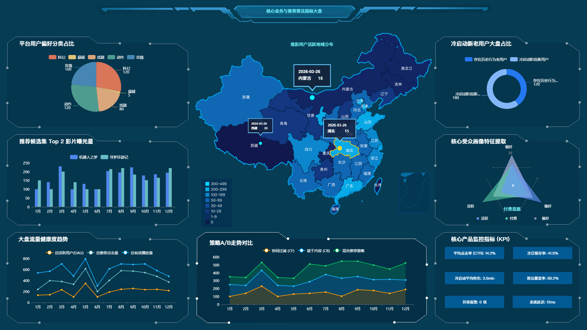

在完成《智能电影数据分析与推荐平台》的底层架构与业务流转设计后，我着手搭建了供运营与算法团队使用的 B 端数据监控看板。

对于数据产品而言，好看的 UI 是次要的，**核心在于通过合理的指标呈现，快速定位业务问题并指导算法迭代。**

## 1. 监控大屏高保真原型

> 采用墨刀进行组件化快速搭建，以“总-分”结构展示核心数据。

## 2. 界面布局与产品思考

### 2.1 全局 KPI 卡片（北极星指标）
置于屏幕最上方，让业务线负责人一眼掌握大盘健康度。
* 选择 **DAU** 和 **推荐模块总曝光** 作为流量基座指标。
* 选择 **平均 CTR** 和 **冷启动转化时长** 作为算法效果的核心衡量标准，辅以环比昨日的红绿升降箭头，提供直观的波动预警。

### 2.2 核心诊断图表区
* **推荐转化漏斗**：直观展示从“曝光”到最终“有效互动（评分/收藏）”的断点在哪里。如果曝光到点击的转化率低，说明召回策略有问题；如果点击到互动的转化率低，说明电影详情页信息展示或精排策略有待优化。
* **算法 A/B 测试对比折线图**：为算法工程师提供直观的反馈。两条趋势线分别代表不同推荐策略（如 Item-CF 与 User-CF）的点击率走势，用数据决定流量的最终倾斜方向。

### 2.3 异常数据下钻挖掘
底部预留了“今日推荐转化率 Top 10 电影”明细表。一方面用于验证推荐是否符合常理，另一方面，若发现某部冷门影片转化率异常高，运营可以手动介入，将其推至首页热门位。

## 3. 总结
一份优秀的数据后台原型，本质上是将复杂的 SQL 查询逻辑与业务目标进行了“可视化翻译”。在绘制这套界面的过程中，我也反向校验了之前定义的数据采集埋点是否足够支撑这些图表的生成。
