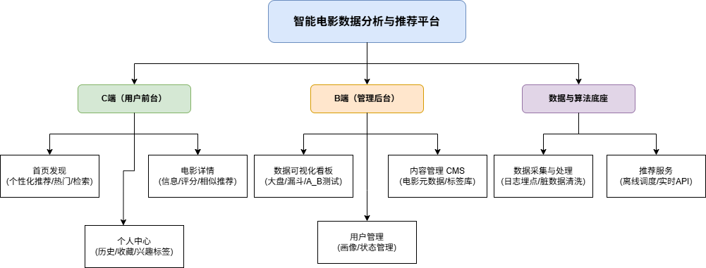

## 1. 项目概述

**产品定位**
一款驱动于用户行为数据与推荐算法的个性化电影分发与决策支持平台。

**目标用户**
* **C端用户**：面临海量影视资源存在“选择困难症”、需要精准内容推荐的观影群体。
* **B端用户**：需要监控平台数据指标、评估推荐算法效果的运营人员及数据产品经理。

**核心痛点解决**
1.  **信息过载**：优化传统分类检索效率，缩短用户获取感兴趣影片的路径。
2.  **长尾内容沉没**：通过推荐算法提升优质冷门电影的曝光率。
3.  **冷启动困难**：设计兴趣标签系统，解决新注册用户缺乏历史数据导致的推荐失效问题。

---

## 2. 产品信息架构 (Information Architecture)

### 2.1 C端（用户前台）
* **首页发现**：个性化推荐Feed流 / 热门排行榜（Top 250/热映） / 电影分类检索
* **电影详情**：基础信息展示 / 用户评分与短评列表 / 相似影片推荐（Item-based）
* **个人中心**：观影历史足迹 / 我的收藏单 / 兴趣标签设置

### 2.2 B端（管理后台）
* **数据可视化看板**：核心指标监控大屏 / 推荐算法A/B测试对比图 / 用户行为漏斗图
* **内容管理 (CMS)**：电影元数据维护 / 标签库管理
* **用户管理**：用户画像查询 / 账号状态管理

### 2.3 数据与算法底座
* **数据采集与处理**：业务日志埋点收集 / 脏数据清洗与特征提取
* **推荐服务**：离线推荐任务调度 / 实时推荐API接口

---

## 3. 核心数据指标定义 (Metrics)

为衡量本平台推荐算法的业务价值，设定以下核心指标用于后台监控：

* **CTR (点击率)**：推荐模块中，影片被点击的次数 / 影片曝光总次数。衡量推荐列表的直接吸引力。
* **留存率 (Retention)**：次日/7日/30日留存率。验证精准推荐是否有效提升了用户粘性。
* **推荐覆盖率 (Coverage)**：周期内被推荐出来的电影数量 / 电影库总数量。评估长尾电影的挖掘效果。
* **冷启动转化时长**：新用户完成兴趣标签勾选，到产生首次“评分/收藏”行为的平均时间间隔。

---

## 4. 核心功能需求：数据可视化看板 (B端)

### 4.1 业务场景
数据产品经理及运营人员需要通过直观的可视化图表，实时监控平台流量健康度，并对比不同推荐策略的实际转化效果，以此作为算法迭代依据。

### 4.2 功能需求列表

| 功能模块 | 功能描述 | 交互规则与展现形式 | 优先级 |
| :--- | :--- | :--- | :--- |
| **全站流量概览** | 统计展示核心大盘数据。 | 顶部卡片式展示：日活(DAU)、新增用户数、总点击量。数值需带环比/同比升降标识。 | P0 |
| **推荐转化漏斗** | 追踪用户转化链路。 | 漏斗图呈现：曝光 -> 点击 -> 详情页停留 -> 收藏/评分。支持日期筛选。 | P0 |
| **热词与标签分布** | 展示站内热门电影标签和搜索词。 | 词云图展现，字体大小与搜索频率成正比。 | P1 |
| **算法效果对比** | 对比不同推荐算法的业务指标差异。| 双线折线图，X轴为时间，Y轴为CTR或平均停留时长。 | P1 |

### 4.3 数据约束与规则
* 看板数据更新频率：大盘数据支持准实时（延迟<5分钟），复杂漏斗数据更新频率为 `T+1`。
* 数据权限：仅对拥有 `Admin` 或 `Data_Analyst` 角色的后台账号开放。
