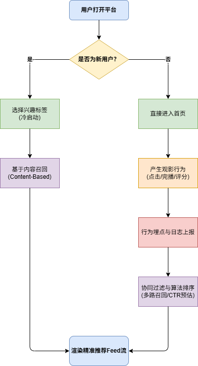

在规划《智能电影数据分析与推荐平台》时，产品设计的核心难点在于：**如何让“冷启动”的新用户迅速感受到推荐的精准度，并让老用户的行为数据能够实时反哺算法模型？**

本篇梳理了平台最核心的业务主线：用户推荐获取链路。

## 1. 核心业务流程图

本流程图按职责划分了“用户交互”、“前端业务”、“推荐引擎”和“数据底座”四个泳道，展示了数据的流向与闭环。

## 2. 关键节点解析

### 2.1 解决“冷启动”问题 (Cold Start)
* **业务痛点**：新注册用户在数据库中没有历史观影记录（行为日志为空），传统的协同过滤算法无法生效。
* **产品方案**：在用户首次登录时，强制或引导其完成“兴趣探测”（如：勾选喜爱的科幻、悬疑标签，或选择几部看过的经典高分电影）。
* **数据流转**：前端收集这些初始偏好，后端调用**基于内容 (Content-Based) 的召回策略**，快速生成一份初始推荐列表，完成用户的首次内容破冰。

### 2.2 行为埋点与数据上报
* **业务逻辑**：推荐系统的准度依赖于丰富的高质量数据。用户在平台的每一次有效交互都具有分析价值。
* **产品方案**：定义前端埋点规范。将用户的行为分为隐式反馈（如：影片曝光、详情页停留时长、播放完成率）和显式反馈（如：五星评分、加入收藏夹）。
* **数据流转**：这些行为日志会被前端打包，通过接口实时上报，落盘到离线数据仓库（如 Hive）用于长期模型训练，同时写入实时缓存（如 Redis）用于更新用户的短期兴趣画像。

### 2.3 召回与排序机制 (Recall & Ranking)
这也是数据产品经理需要理解的算法黑盒中的基本逻辑：
* **召回阶段**：从百万级电影库中，利用多路召回策略（协同过滤、基于标签等）快速筛选出几百部用户可能感兴趣的候选集。
* **排序阶段**：对这几百部电影进行 CTR（点击率）预估打分，结合业务规则（如：近期热映加权、已看电影降权），最终输出 Top N 的列表渲染给前端。
